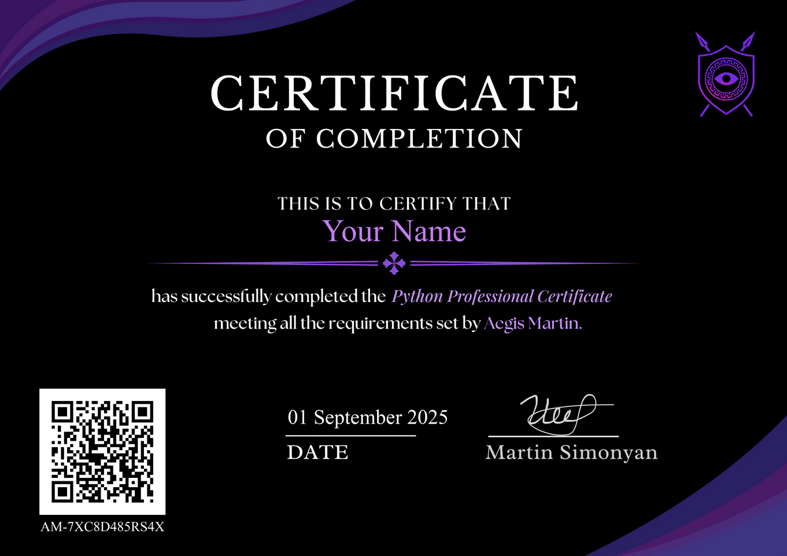

# 🛡️ Aegis Martin — Professional Python Certificate Program  

**The world’s first 1-on-1 Python mentorship with certification.**  
Learn Python from zero to mastery, build real projects, and graduate with a verifiable certificate.  

---
,
## 📖 Curriculum  
- **Module 1 Python Foundations** — Syntax, Conditionals, Error Handling, functions, File Handling  
- **Module 2 OOP and Advanced Python** — OOP, Internal and External Modules
- **Module 3 Real World Applications** — Sockets, Threading, Real World Applications 
- **Real Projects** — View Bellow
- **Final Exam & Certification** - After finishing the final project
- **Final Exam & Certification** - [View The full Curriculum](Curriculum/Certification_Program_Curriculum.md)

---

## 🏆 Certificate  
Students who complete the program receive the official **Aegis Martin Professional Python Certificate**, verifiable at:  
👉 [aegismartin.com/certificates](https://aegismartin.com/certificates)  

  

---

## 💻 Projects  
Hands-on, portfolio-ready projects included in the program for each progression level:  
Module 1 Python Foundations - Collecting Items Game
Module 2 OOP and Advanced Python - Battle Simulator Game
Module 3 Real World Applications - Multi-Client Messaging System
Certification - Exam Project fully developed by the student

---

## 🔗 Verification  
Every certificate issued has:  
- ✅ A unique ID number  
- ✅ A QR code  
- ✅ Verification at [aegismartin.com/certificates](https://aegismartin.com/certificates)  

---

## 📬 Contact  
Interested in enrolling?  
Visit 👉 [Aegis Martin](https://aegismartin.com) or DM me directly.  

---

## ⚖️ License  
Copyright © 2025 Aegis Martin.  
All rights reserved.  
Content may not be copied, modified, or redistributed without explicit permission.  
Certificates are only valid through verification at [aegismartin.com](https://aegismartin.com/certificates)  
